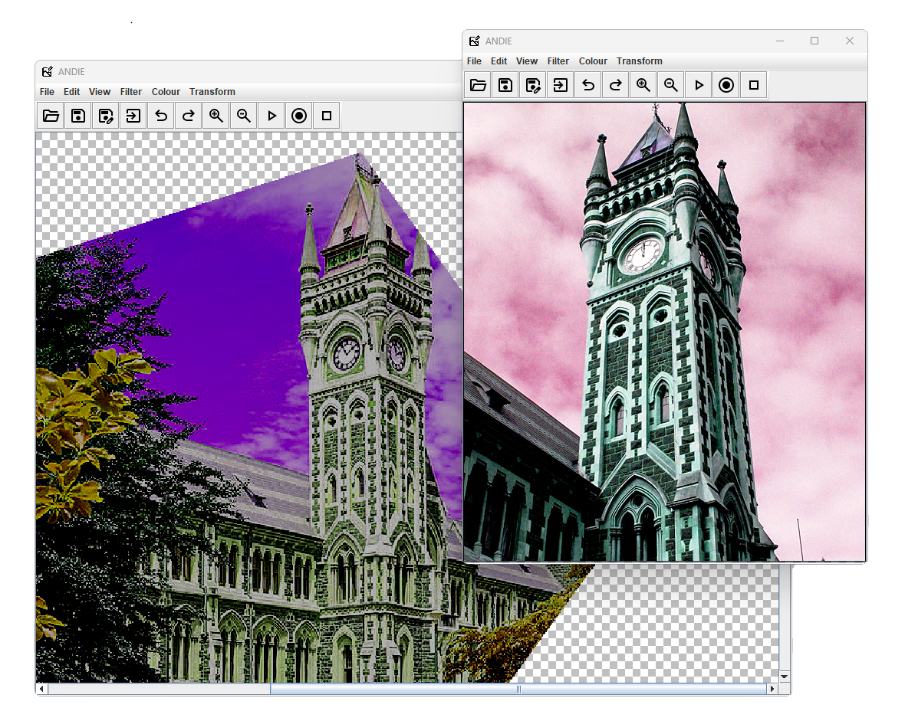
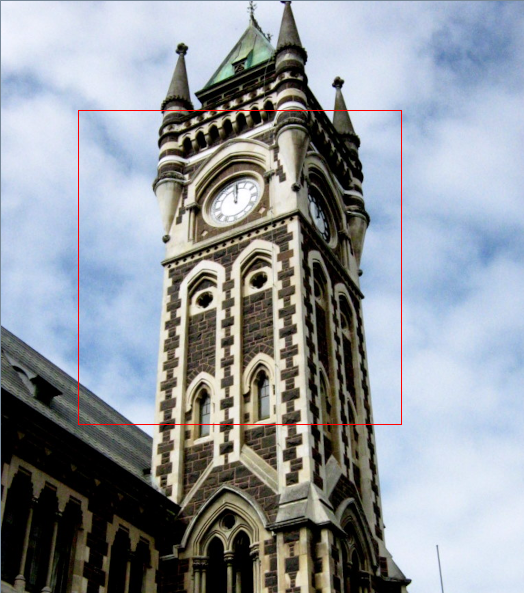

# ANDIE Information - COSC202 Mavericks



## Table of Contents
1. [Build Status](#build-status)
2. [What is ANDIE?](#what-is-andie)
3. [How do I use ANDIE?](#how-do-i-use-andie)
    1. [Installation](#installation)
    2. [Running the Program](#running-the-program)
    3. [Opening an Image](#opening-an-image)
    4. [Undoing/Redoing Operations](#undoingredoing-operations)
    5. [Saving and Exporting](#saving-and-exporting)
    6. [Applying Filters](#applying-filters)
    7. [Mouse Selection](#mouse-selection)
    8. [Macro Operations](#macro-operations)
    9. [Changing the Language](#changing-the-language)
    10. [More Help/Troubleshooting](#more-helptroubleshooting)
4. [How the Code was Tested](#how-the-code-was-tested)
5. [Who Did What](#who-did-what)


## Build Status
[](https://github.com/iiJC/andie/actions/workflows/.gitlab-ci.yml)
[](https://github.com/iiJC/andie/actions/workflows/pages/pages-build-deployment)

## What is ANDIE?

ANDIE is "A Non-Destructive Image Editor" which edits and manipulates images by storing the sequences of operations that are applied to the image into an operations file. This allows the user to undo and redo operations. As the operations are applied separetely, the original image's information is retained.

## How do I use ANDIE?

### Installation

To use ANDIE, follow these steps:

1. **Download the repository**:

   - Download as a ZIP file by clicking **Clone > Download ZIP** on the GitHub page. Extract the contents to your desired folder.
   - Or, if you are familiar with git, clone the repository using:
     ```bash
     git clone https://altitude.otago.ac.nz/cosc202-mavericks/andie.git
     ```

2. **Open in an IDE**:
   - You can directly open the project in your IDE (e.g., Eclipse, IntelliJ) by choosing **Clone > Open in IDE** on GitHub.

### Running the program
To run ANDIE, execute the jar file `andie.jar`
```bash
java -jar andie.jar
```
Alternatively you can run the source code `Andie.java` from the directory `\src\ANDIE`.

#### Opening an image

- **Supported Formats**: ANDIE can open PNG, JPEG and BMP images. To open an image, navigate to **File > Open** in the top toolbar
- Alternatively, provided the image is in a supported format, you can open an image from the clipboard with **CTRL+V**, or through **Edit > Paste**. This works well with the default Windows Snipping Tool.

#### Undoing/Redoing Operations

- ANDIE allows you to undo or redo multiple operations. Access this feature via **Edit > Undo** or **Edit > Redo**. 
- Alternatively you can use the keybinds **CTRL+Z** and **CTRL+Y** for Undo and Redo respectively.

#### Saving and Exporting

- **Save Operations**: To save the current list of operations, select **File > Save**. This saves the operations, not the image state.
- **Export Image**: Export the current image with applied operations by selecting **File > Export**.
  By default, it will export the image as `image.png`.
  You can change the file type to any of the supported file types by changing the file extension manually: .jpeg, .jpg or .bmp
  If no file type is specified, it will export the image as a .png by default.

#### Applying Filters

- To apply a filter, open an image and select a filter from the **Filter** menu. Descriptions of what each filter does can be found in the menu.
  For example, to apply a Greyscale filter to the image: 
  **Filter > Greyscale**
### Mouse Selection



By holding the left mouse button and dragging, you can select a region of the image. This appears as a red rectangle, which you can then use to crop or draw shapes within the selected region.

#### Crop

After selecting a region, crop the image to the selected area (within the red rectangle) by:
**Transform > Crop**

#### Drawing Shapes

After selecting a region, choose a shape that fills the dimensions of the selected region, as well as its color by:
**Transform > Draw**

### ClipSelect

You can crop the image into a preset shape using:
***Transform > Clip to Shape**


### Macro Operations

Macro files are stored in **.ops** files. By default, macros are saved to and attempts to open them from `./src/saved-macros`.

#### Applying a Macro

When an image is present, to apply a macro, from the toolbar press the **Apply Toolbar** and select a .ops file.

#### Recording a Macro

When an image is present, from the toolbar, after pressing the **Record Macro** button, any operations applied to the image will be recorded.
Pressing this button while recording can cancel the recording.

#### Saving a Macro

While recording, to save a macro, after applying at least one operation to the image, the stack of operations will be saved in a .ops file, by default to `./src/saved-macros`.
This will end the recording after saving the macro.

### Changing the Language

To change the preferred language click the menu options **File > Language** and select the preferred language from the menu.
Restart the program to see the applied language changes.

### More help/Troubleshooting

If you encounter errors while building or running the source code with Gradle, try running: `./gradlew clean build` as it often solves the issue.

For more information, refer to the [API Javadoc](https://iijc.github.io/andie/).

## How the code was tested

- **Manual Testing** - We ensured that from a general user's perspective the code functions as expected. Exception handling mechanisms were also tested through manual inputs to ensure they handled certain scenarios such as boundary cases.

- **Integration Testing** - During the merging of our individual branches into the main branch, we performed integration testing. After integrating each branch, we thoroughly tested the combined codebase to identify and resolve any merge issues. This ensured that ANDIE was fully operational before proceeding to merge subsequent branches. We repeated this process for each branch until all branches were successfully merged and any issues were resolved.

- **Unit Testing and Continuous Integration** - JUnit tests were added to a CI pipeline to ensure all tests in the main branch pass, and checks that the main branch can compile and build properly.

## My Contributions:
Original Project Contributions:
- Exception Handling
  - Standardized error messages and dialogue into each of the lang.properties
- Multilingual Support
  - This was implemented mainly through the "Settings.java" class, which generates, loads and updates a config file of the user's preferences
  - Saved language translations in their respective files as \*\_lang.properties
  - Also includes modifications to each JMenu in the Toolbar to utilize the language files rather than local Strings
  - Writing and translation of error messages, exceptions and dialog messages.
- File Exporting
  - Exports the current image through the file explorer
  - Includes automatically saving the image as a .png by default if no file type is specified.
  - Includes exception handling to manage error cases, such as invalid file types
- Keyboard Shortcuts
- Macros - Applying, Recording, Saving
- Toolbar with Icons
- Clipboard
  - Opening an image from Clipboard
  - Copying the current image and any applied operations to the Clipboard
- README User Guide
- CI Pipeline

GitHub Release:
- Adapting the project CI to GitHub
- Integrating documentation into GitHub Wiki, rather than a giant README.

For notes on features not developed by me, or notes on my modifications to the others' features can be found in the wiki.
