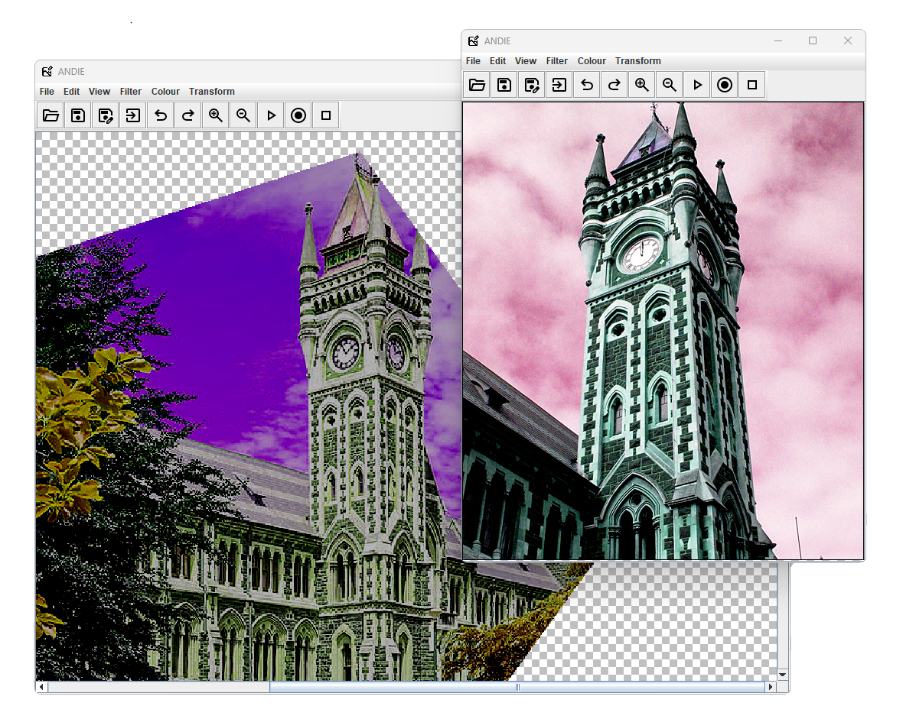
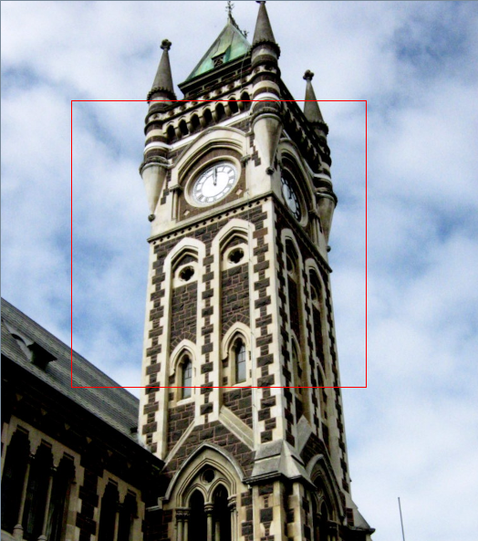

# ANDIE Information - COSC202 Mavericks



## Table of Contents
1. [Build Status](#build-status)
2. [What is ANDIE?](#what-is-andie)
3. [How do I use ANDIE?](#how-do-i-use-andie)
    1. [Installation](#installation)
    2. [Running the Program](#running-the-program)
    3. [Opening an Image](#opening-an-image)
    4. [Undoing/Redoing Operations](#undoingredoing-operations)
    5. [Saving and Exporting](#saving-and-exporting)
    6. [Applying Filters](#applying-filters)
    7. [Mouse Selection](#mouse-selection)
    8. [Macro Operations](#macro-operations)
    9. [Changing the Language](#changing-the-language)
    10. [More Help/Troubleshooting](#more-helptroubleshooting)
4. [How the Code was Tested](#how-the-code-was-tested)
5. [Who Did What](#who-did-what)


## Build Status
[](https://altitude.otago.ac.nz/cosc202-mavericks/andie/pipelines)

## What is ANDIE?

ANDIE is "A Non-Destructive Image Editor" which edits and manipulates images by storing the sequences of operations that are applied to the image into an operations file. This allows the user to undo and redo operations. As the operations are applied separetely, the original image's information is retained.

## How do I use ANDIE?

### Installation

To use ANDIE, follow these steps:

1. **Download the repository**:

   - Download as a ZIP file by clicking **Clone > Download ZIP** on the GitHub page. Extract the contents to your desired folder.
   - Or, if you are familiar with git, clone the repository using:
     ```bash
     git clone https://altitude.otago.ac.nz/cosc202-mavericks/andie.git
     ```

2. **Open in an IDE**:
   - You can directly open the project in your IDE (e.g., Eclipse, IntelliJ) by choosing **Clone > Open in IDE** on GitHub.

### Running the program
To run ANDIE, execute the jar file `andie.jar`
```bash
java -jar andie.jar
```
Alternatively you can run the source code `Andie.java` from the directory `\src\ANDIE`.

#### Opening an image

- **Supported Formats**: ANDIE can open PNG, JPEG and BMP images. To open an image, navigate to **File > Open** in the top toolbar
- Alternatively, provided the image is in a supported format, you can open an image from the clipboard with **CTRL+V**, or through **Edit > Paste**. This works well with the default Windows Snipping Tool.

#### Undoing/Redoing Operations

- ANDIE allows you to undo or redo multiple operations. Access this feature via **Edit > Undo** or **Edit > Redo**. 
- Alternatively you can use the keybinds **CTRL+Z** and **CTRL+Y** for Undo and Redo respectively.

#### Saving and Exporting

- **Save Operations**: To save the current list of operations, select **File > Save**. This saves the operations, not the image state.
- **Export Image**: Export the current image with applied operations by selecting **File > Export**.
  By default, it will export the image as `image.png`.
  You can change the file type to any of the supported file types by changing the file extension manually: .jpeg, .jpg or .bmp
  If no file type is specified, it will export the image as a .png by default.

#### Applying Filters

- To apply a filter, open an image and select a filter from the **Filter** menu. Descriptions of what each filter does can be found in the menu.
  For example, to apply a Greyscale filter to the image: 
  **Filter > Greyscale**
### Mouse Selection



By holding the left mouse button and dragging, you can select a region of the image. This appears as a red rectangle, which you can then use to crop or draw shapes within the selected region.

#### Crop

After selecting a region, crop the image to the selected area (within the red rectangle) by:
**Transform > Crop**

#### Drawing Shapes

After selecting a region, choose a shape that fills the dimensions of the selected region, as well as its color by:
**Transform > Draw**

### ClipSelect

You can crop the image into a preset shape using:
***Transform > Clip to Shape**


### Macro Operations

Macro files are stored in **.ops** files. By default, macros are saved to and attempts to open them from `./src/saved-macros`.

#### Applying a Macro

When an image is present, to apply a macro, from the toolbar press the **Apply Toolbar** and select a .ops file.

#### Recording a Macro

When an image is present, from the toolbar, after pressing the **Record Macro** button, any operations applied to the image will be recorded.
Pressing this button while recording can cancel the recording.

#### Saving a Macro

While recording, to save a macro, after applying at least one operation to the image, the stack of operations will be saved in a .ops file, by default to `./src/saved-macros`.
This will end the recording after saving the macro.

### Changing the Language

To change the preferred language click the menu options **File > Language** and select the preferred language from the menu.
Restart the program to see the applied language changes.

### More help/Troubleshooting

If you encounter errors while building or running the source code with Gradle, try running: `./gradlew clean build` as it often solves the issue.

For more information, refer to the [API Javadoc](https://cosc202-mavericks.cspages.otago.ac.nz/andie).

## How the code was tested

- **Manual Testing** - We ensured that from a general user's perspective the code functions as expected. Exception handling mechanisms were also tested through manual inputs to ensure they handled certain scenarios such as boundary cases.

- **Integration Testing** - During the merging of our individual branches into the main branch, we performed integration testing. After integrating each branch, we thoroughly tested the combined codebase to identify and resolve any merge issues. This ensured that ANDIE was fully operational before proceeding to merge subsequent branches. We repeated this process for each branch until all branches were successfully merged and any issues were resolved.

- **Unit Testing and Continuous Integration** - JUnit tests were added to a CI pipeline to ensure all tests in the main branch pass, and checks that the main branch can compile and build properly.

## Who did what

**Angus:**

- Sharpen Filter
  - By following similar instructions displayed in the lab book for the MeanFilter operation, I tested and implemented the Sharpen Filter through convolution with the suggested 3x3 Kernel. The action can be performed through the Filter tab in the menu.
- Colour Channel Cycling
  - I tested this implementation through creating a JComboBox which allowed me to run multiple different options of RGB colour channels through matching each option to a specific indexed action. In the ColourChannelCycling class, I have used a switch statement to match the index to the chosen RGB re-order option. This action can be executed through the Colours tab in the menu.

**Hadrien**

- Median Filter
- Gaussian Blur Filter
  - I tested this using a print message to check that the kernel was the same as the one on the lab instructions
- Emboss Filter, Sobel Filter
- Convolution (with padding that takes the nearest valid pixel)
  - I tested this with unit tests. I ran the convolution on Excel and compared the numbers to make sure that my code was doing the right things.
- Laplacian Filter
  - Added the Laplacian filter feature, which is an edge detection filter.

**Marcus:**

- Error handling:

  - I implemented try and catch statements within the resize and transform action menu classes to prevent user input from crashing the program by inputting anything that wouldn’t be a positive number. I complemented the try and catch statements with GUI boxes that helped visualize to the users what occurred, giving them instructions on how to prevent the next mistake so the program can run smoothly. I tested these different catch statements by trying various inputs such as letters, decimals, and negative numbers to see how responsive it was. I made each error message unique so that users could see specifically what they did wrong.

- Image Inversion:

  - By reviewing the greyscale code, I was able to recreate the image inversion action. This simply inverts the color of the image by iterating over the pixels and updating the RGB values to 255 minus their original values. I tested it by comparing the inverted image to the image on Blackboard and other online image editors to see if ANDIE was producing similar results.  Can be accessed through \*\*Colour > Image Inversion.

- Image Resize:

  - Scales the image up or down depending on the user's input on what percentage the image should scale to. If the user enters 10, the image would shrink down to 10% of its original size. If the user enters 150, the image would scale up to 150% of its original size. Can be accessed through the TransformActionMenu. I tested it by inputting different numbers to see if it scaled appropriately and implemented debug statements while developing to see if all the methods were running.

- TransformActionMenu:

  - Coded the TransformAction menu so Ned and I could separate the rotate and resize features from other menus, as resize and rotate focus on transforming an entity while the other menu provides filters. I also used this menu to set up try and catch statements for user input error handling so the program doesn't crash while people use the resize image feature.

- Transparency

  - The transparency action was one of the additional features that I contributed towards the group project. It can be accessed through **Transform → Transparency**. The user is provided with a slider ranging from 0 - 100. 0 being fully transparent and 100 being fully opaque. The user will direct the slider to where they want, say 50, then the transparency filter will reduce the opacity of the image to 50% of its original opacity. I wanted to implement this feature as I believed it would complement the draw function. I tested this feature by going through the edge cases with various images such as JPG, PNG, large image files, small image files, and testing with images that were already partially transparent. I proceeded with some unit testing to ensure all the primary aspects and methods were returning the appropriate values.
  - This is what I tested:

    - Full-transparent: passed, all pixels had a alpha of 0.
    - Tested fully opaque: passed, all pixels had a alpha of 255.
    - Intermediate transparency: passed, testing at each indice on the slider from 0-100.
    - Tested null-image input: passed, with try and catch message popping up.
    - Tested over the max transparency, such as 101: passed with images still retaining alpha values of 255.
    - Tested negative transparency values, such as -1: passed with images retaining alpha values of 0.

  - There was some initial issue’s with getting the transparency slider to show the image’s current opacity and return to it’s original opacity. However that was debugged via providing a transparencylevel, and it was tested thoroughly to ensure it worked appropriately.

- Checkered BackGround:

  - The checkered background was a simple feature that I wanted to implement and was added to complement the transparency feature. It also made ANDIE look more professional and comparable to other image editors such as Photoshop or Google Drawings. The checkered background is produced in the ImagePanel when ANDIE is initially opened. I tested this rigorously by adding multiple images of different sizes and formats, while testing each implemented feature to ensure it didn’t conflict with the image editor. I also tested it by stretching the panel of ANDIE and images to ensure the checkered background worked appropriately.

- RandomScattering:

  - This feature can be accessed through **Filter → ScatterFilter**. This filter takes an input from the user, ranging from 1 - Integer.MAX_VALUE. The image will randomly scatter depending on the radius provided by the user. I used JUnit to run a number of unit tests on the RandomScatteringFilter class to make sure it was reliable and functional. Large radius scattering, null input, edge handling, and basic scattering were among the scenarios that were explored in the testing. The outcomes demonstrated that even with a huge radius, the filter successfully scattered pixels and handled edge pixels by clamping them within image bounds. It also correctly applied a random scattering effect within the set radius and returned null for null input images. These tests verify that the RandomScatteringFilter class operates as anticipated, yielding dependable outcomes under various circumstances.

- BlockAveraging:

  - This feature can be accessed through **Filter → Block Averaging Filter**. This filter provides two input options: width and height. The user can specify rectangles or squares based on their input. The image will pixelate to the specifications based on the user’s input. I used JUnit to run a number of unit tests on the BlockAveragingFilter class to make sure it functions and is reliable. The tests addressed a wide range of circumstances, such as non-ARGB image handling, edge handling, null input, and basic block averaging. The findings demonstrated that the filter handled edge cases where blocks extend beyond image boundaries, correctly applied the block averaging effect by averaging the colors within designated block dimensions, returned null for null input images, and correctly converted non-ARGB images to ARGB before applying the filter. These tests verify that the BlockAveragingFilter class operates as anticipated, yielding dependable and consistent outcomes under various circumstances.

- Additional error-handling:
  - With more exception handling for the Part 2 deliverables, I wanted to focus on preventing users from entering errors overall. Therefore, I opted for the approach of implementing JSpinner’s, enabling the users to specify the values they want while preventing them from making user errors such as inputting decimals, letters, or negative values. This created a more controlled environment within the RandomScattering and BlockAveraging filters. For the transparency, I implemented a slider. Another feature I added was a dialogue box which would appear if users tried using a feature without loading an image, instructing them that an image had to be loaded before the feature could be used. Overall, I believe these were improvements. I tested these features thoroughly throughout the different actions by trying to provide null inputs, incorrect files, and case studies in which the max and minimum inputs were provided along with random numbers to see how the program would react.

Overall I used a variety of photos to test each feature, including ones in PNG and JPG formats, both large and small in size, transparent, and with varying colors and alpha ranges. This extensive testing made sure the functions work properly in a variety of situations.

**Ned:**

- Exception Handling
  - I created exceptions using try and catch statements for things like trying to use filters with no image selected, and trying to open a non-image file, which originally crashed the program. It now shows an error message (from Marcus) and returns to the program.
- Image rotations
  - Creates a new image with either the same height and width if changing 180 degrees or swapped height and widths for 90 and 270 degrees, and uses the pixels of the original to fill it at the desired angle. This can be accesed from **Transform > Rotate**.
- Image Flip
  - Creates a new image with the same height and width and fills it with the pixels from the original in a reversed vertical or horizontal order. This can be accessed from **Transform > Horizontal Flip** or **Transform > Vertical Flip**.

**Jonathan:**

- Exception Handling
  - Standardized error messages and dialogue into each of the lang.properties
- Multilingual Support
  - This was implemented mainly through the "Settings.java" class, which generates, loads and updates a config file of the user's preferences
  - Saved language translations in their respective files as \*\_lang.properties
  - Also includes modifications to each JMenu in the Toolbar to utilize the language files rather than local Strings
  - Writing and translation of error messages, exceptions and dialog messages.
- File Exporting
  - Exports the current image through the file explorer
  - Includes automatically saving the image as a .png by default if no file type is specified.
  - Includes exception handling to manage error cases, such as invalid file types
- Keyboard Shortcuts
- Macros - Applying, Recording, Saving
- Toolbar with Icons
- Clipboard
  - Opening an image from Clipboard
  - Copying the current image and any applied operations to the Clipboard
- README User Guide
- CI Pipeline
